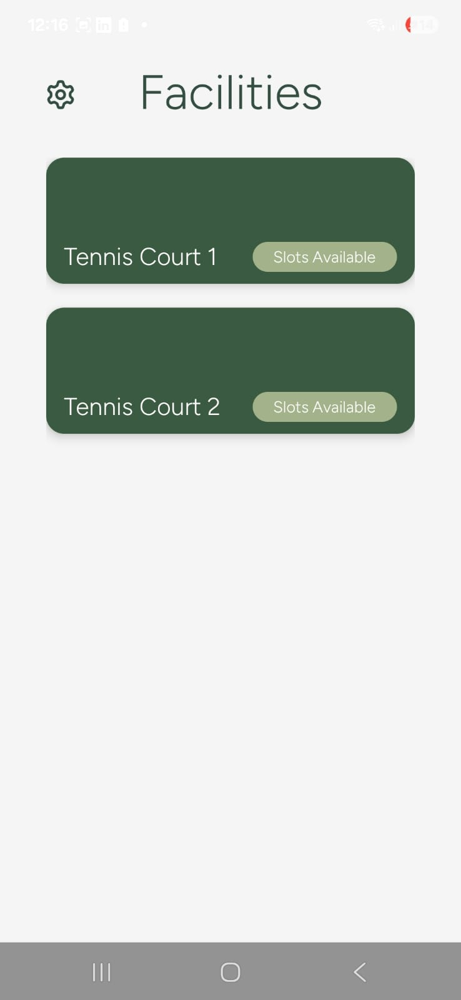
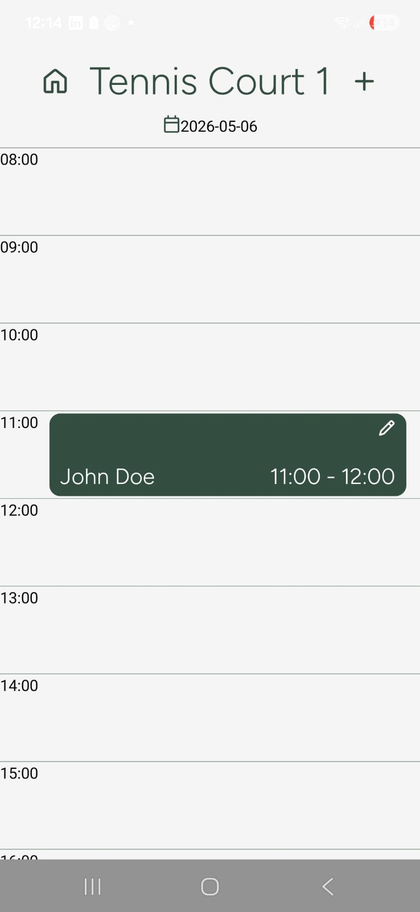

# Booking Application Front End

## Table of Contents

- [Overview](#overview)
- [Built With](#built-with)
- [Features](#features)
<!-- - [Contact](#contact) -->
<!-- - [Acknowledgements](#acknowledgements) -->

## Overview

This is a client project. The client requested that I make a facility booking application for their estate, as they needed a more organised way to book out their sports facilities. The application allows the admin to add facilities and change other users' bookings, and the users are able to make bookings as well as edit them. 

The biggest challenge with this project ended up being connecting the back-end to the front-end seamlessly. This was achieved after a bit of trial and error, and now the front end and the backend communicate smoothely. The other biggest challenge was making so the app can be downloaded onto iOS devices. This ended up being an IPV issue, as Apple Review works on IPV6 not IPV5. This has been sorted. 

### Built With

- React Native
- CSS
- JavaScript
in conjunction with the back end that consists of:
- Node.js
- SQLite

## Features

<!-- ## Contact -->

<!-- ## Acknowledgements -->
